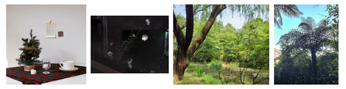
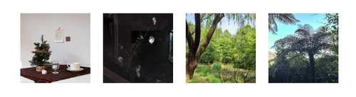
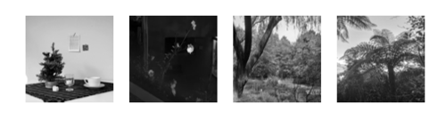
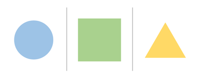

# 이미지 데이터 크롤링 및 처리


## Version

- python: 3.8.11  
- pillow: 8.3.1  
- selenium: 3.141.0  
- urllib3: 1.26.6  


## Example

```python
# Import pincette.py
from pincette import *

# Settings
driver = "chromedriver.exe"   # 0
url = "https://pincette.netlify.app/"
...

# Crawling and Processing
ic = ImgCrawler(driver, options)   # 1
ic.crawl_img(url, gif_dir, scroll=False)   # 2
ic.gif_to_png(gif_dir, img_dir, copy_imgs=True)   # 3
ic.convert(img_dir, result_dir, img_size=(32, 32), gray_scale=True)   # 4
```
`#0`: 해당 코드는 <a href="https://chromedriver.chromium.org/downloads" target="_blank">Chrome-Driver</a>를 사용합니다.  
`#1`: driver 경로와 옵션 값을 설정합니다. 옵션은 튜플 형식으로 사용하며, 생략할 수 있습니다.  
`#2`: 크롤링을 수행합니다. [(참고)](#customize)  
`#3`: gif 이미지를 png 이미지로 나누어 줍니다.  
`#4`: 이미지의 크기를 조정하거나 색상을 회색조로 변경할 수 있습니다.  


자세한 설명은 docstring을 참고해 주세요.  
```python
>>> from pincette import *
>>> print(ImgCrawler.__doc__)
...
>>> print(ImgCrawler.crawl_img.__doc__)
...
```

**예시 이미지**



resized:  


grayscale:  


**예시 이미지(gif)**


gif_to_img:  



## Customize

`pincette.py`: line 65 ~ 68 을 수정 후 사용합니다.  
자세한 내용은 <a href="https://www.selenium.dev/documentation/webdriver/elements/finders/" target="_blank">Selenium 문서</a> 참고.


## Test

`index.html`: [테스트 페이지](https://pincette.netlify.app/)를 제공합니다.  
현재 _pincette.py_ 는 테스트 페이지를 크롤링할 수 있도록 작성되었습니다.  

`pincette.py`: line 175 ~ 197  
```python
if __name__ == "__main__":

    # 현재 경로
    CWD = os.getcwd()

    def make_dir(*file_name):
        dir = os.path.join(CWD, *file_name)
        os.makedirs(dir, exist_ok=True)
        return dir

    # 설정 값
    gif_dir = make_dir("test", "crawled")
    img_dir = make_dir("test", "imgs")
    result_dir = make_dir("test", "converted")
    options = ("window-size=1920,1080",)
    driver = "chromedriver.exe"
    url = "https://pincette.netlify.app/"

    # 작업 수행
    ic = ImgCrawler(driver, options)
    ic.crawl_img(url, gif_dir, scroll=False)
    ic.gif_to_png(gif_dir, img_dir, copy_imgs=True)
    ic.convert(img_dir, result_dir, img_size=(32, 32), gray_scale=True)
```