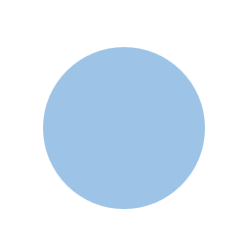

# Pincette

`selenium`과 `pillow`를 활용한 이미지 수집 및 처리 모듈  

---

__최근 수정 내용__: gif_to_img 수행 시 프레임 수 제한. (06/04)  

- [Version](#version)  
- [Example](#example)  
- [Extension](#extension)  
    - [selenium](#use-selenium)  
    - [bs4](#use-bs4)  
- [Test](#test)
    - [Result](#result)

---

## Version

```Shell
$ pip install -r requirements.txt
```

- python: 3.8.11  
- pillow: 9.0.1  
- selenium: 3.141.0  
- urllib3: 1.26.6  

## Example

```python
# pincette.py 가져오기
from pincette import *

# 설정
gif_dir = make_dir("test", "crawled")
img_dir = make_dir("test", "imgs")
result_dir = make_dir("test", "converted")
driver = "chromedriver.exe"   # 1
url = "https://pincette.netlify.app/"

# 크롤링 및 처리
pn = Pincette(driver)   # 2
pn.load_page(url, scroll=False)   # 3
pn.find_imgs("image__content")   # 4
pn.save_imgs(gif_dir, progess=True)   # 5
pn.close_tab()   # 6
pn.gif_to_img(gif_dir, img_dir, copy_imgs=True)   # 7
pn.convert(img_dir, result_dir, img_size=(32, 32), gray_scale=True)   # 8
```
`#1`: 해당 코드는 <a href="https://chromedriver.chromium.org/downloads" target="_blank">Chrome-Driver</a>를 사용합니다.  
`#2`: driver 경로와 옵션 값을 설정합니다. 옵션은 생략할 수도 있습니다.  
`#3`: 크롤링을 수행하기 위해 페이지를 로딩합니다.  
`#4`: 이미지 주소를 태그의 class로 찾아 저장합니다.    
`#5`: 찾은 이미지를 저장합니다.  
`#6`: 브라우저와 driver를 종료합니다.  
`#7`: gif 파일을 여러 이미지로 나누어 줍니다.  
`#8`: 이미지의 크기를 조정하거나 색상을 회색조로 변경할 수 있습니다.  


자세한 설명은 docstring을 참고해 주세요.  
```python
>>> from pincette import *
>>> print(Pincette.__doc__)
...
>>> print(Pincette.load_page.__doc__)
...
>>> print(make_dir.__doc__)
...
```

## Extension

`extend_srcs`: 해당 함수는 Pincette의 저장 대기 목록에 주소들을 포함시킵니다.  
따라서, 자체적으로 정보를 가져와 Pincette 모듈의 기능을 활용할 수 있습니다.  
```python
urls = ["https://...img-1.png", "https://...img-2.png", ... ]
pn.extend_srcs(urls)
```

### Use selenium

`Pincette`는 `driver`속성을 가지고 있으며, 이는 selenium의 `webdriver.Chrome`과 동일합니다.  
따라서 <a href="https://www.selenium.dev/documentation/webdriver/elements/finders/" target="_blank">selenium</a>의 함수를 그대로 사용할 수 있습니다.  
```python
pn = Pincette(driver_path)

element = pn.driver.find_element_by_class_name("content")
src = element.get_attribute("src")

pn.extend_srcs([src])
pn.save_imgs(...)
...
```

### Use bs4

`bs4`를 활용해 크롤링을 진행하고, pincette을 이용해 처리하는 것도 가능합니다.  
```python
import requests
from bs4 import BeautifulSoup

from pincette import *

URL = "https://pincette.netlify.app/"

# bs4를 활용한 크롤링
request = requests.get(URL)
soup = BeautifulSoup(request.text, "html.parser")
imgs = soup.find_all("img", attrs={"class": "image__content"})

srcs = list()   # 1
for img in imgs:
    src = img["src"]
    srcs.append(src)

# pincette을 활용한 저장
gif_dir = make_dir("test", "crawled")

pn = Pincette(None)   # 2
pn.extend_srcs(srcs)   # 3
pn.save_imgs(gif_dir, progess=True, ignore=False)
```
`#1`: 이미지 주소를 list 또는 tuple의 형태로 저장합니다.  
`#2`: Pincette에 None을 넘겨주면 driver 없이 사용할 수 있습니다.  
`#3`: Pincette의 저장 대기 목록에 주소들을 포함시킵니다.  

## Test

자체적인 [테스트 페이지](https://pincette.netlify.app/)를 제공합니다.  
테스트 페이지의 이미지를 수집하는 코드는 아래와 같습니다.  
```python
from pincette import *

# 설정 값
gif_dir = make_dir("test", "crawled")
img_dir = make_dir("test", "imgs")
result_dir = make_dir("test", "converted")
driver = "chromedriver.exe"
url = "https://pincette.netlify.app/"

# 작업 수행
pn = Pincette(driver, "window-size=1920,1080", "--disable-gpu")
pn.load_page(url, scroll=False)
pn.find_imgs("image__content")
pn.save_imgs(gif_dir, progess=True)
pn.close_tab()
pn.gif_to_img(gif_dir, img_dir, copy_imgs=True)
pn.convert(img_dir, result_dir, img_size=(32, 32), gray_scale=True)
```

### Result

**수집된 이미지**
<div style="display: flex; flex-direction: row;">
    
    
</div>

gif_to_img:  


resized:  


grayscale:  
